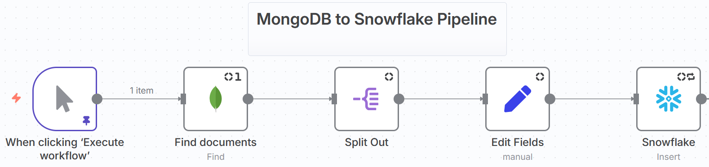
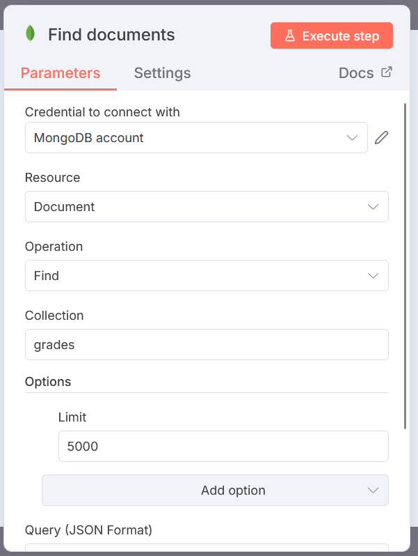
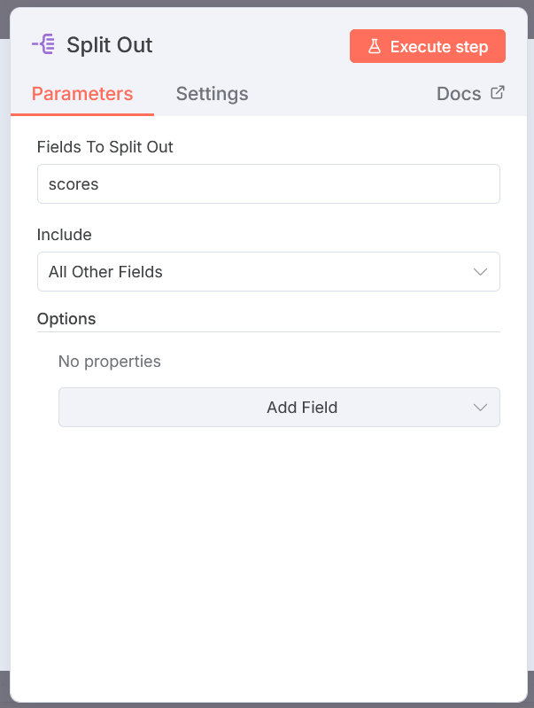
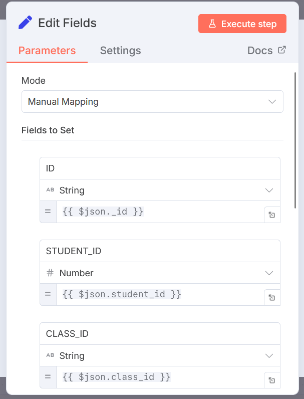
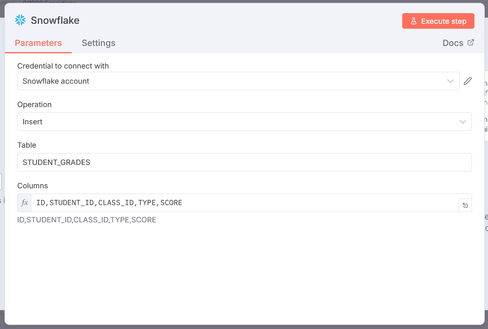

# ⚡ n8n-mongo2snow-pipeline

End-to-end ETL pipeline from **MongoDB** to **Snowflake**, built entirely in **n8n**.  
This repo demonstrates how to extract, transform, and load data seamlessly between a NoSQL database and a modern cloud data warehouse.

Includes:
- ✅ Problem statement (business & technical views)
- ✅ Visual workflow
- ✅ Screenshots of each n8n node
- ✅ Step-by-step explanation
- ✅ Demo video walkthrough

---

## ❓ Problem Statement

### 🔹 Business Perspective
Organizations often store critical operational data in **MongoDB**, which is optimized for flexible, fast storage but not for analytics.  
Business users and analysts struggle because:
- MongoDB data is **unstructured/semi-structured JSON**, hard to use directly in BI tools.  
- Strategic decisions require **clean, structured data** in a warehouse like Snowflake.  
- Manual data exports are **time-consuming, error-prone, and not scalable**.  

**Business Impact:**  
Without automation, reporting is delayed, decision-making slows down, and teams cannot fully leverage their data assets.  

---

### 🔹 Technical Perspective
From a data engineering standpoint, the challenges are:
- **Schema mismatch:** MongoDB’s document model ≠ Snowflake’s relational model.  
- **ETL complexity:** Requires extracting documents, splitting arrays/objects, and reshaping fields.  
- **Automation need:** Manual scripts and exports do not scale with large or frequently updated datasets.  
- **Data consistency:** Ensuring every run inserts clean, transformed records into Snowflake.  

**Technical Solution with n8n:**  
This pipeline automates the **ETL process** using **n8n workflows**:  
1. **Extracts** documents from MongoDB  
2. **Transforms** them into a Snowflake-ready schema  
3. **Loads** the structured data into Snowflake tables  

This ensures data is consistently available for analytics, reporting, and downstream applications.  

---

## 📊 Workflow Overview (n8n)

This pipeline is built in **n8n** to move data from **MongoDB → transforms it → Snowflake**.  

---

## 🛠️ Step-by-Step Breakdown (n8n Nodes)

### 1️⃣ Trigger Node
**When clicking 'Execute workflow'**  
- Manually starts the pipeline execution.
- Useful for controlled runs or testing.

---

### 2️⃣ MongoDB - Find Documents
- Connects to the MongoDB database.
- Fetches documents based on a query or filter.
- Acts as the **Extract** step in ETL.

---

### 3️⃣ Split Out
- Splits the retrieved documents containing JSON array into individual records.

---

### 4️⃣ Edit Fields
- Cleans and transforms fields to match Snowflake schema.
- Allows renaming, restructuring, or dropping unwanted fields.
- Acts as the **Transform** step in ETL. 

---

### 5️⃣ Snowflake - Insert
- Inserts the cleaned records into Snowflake.
- Ensures data is stored in structured tables.
- Acts as the **Load** step in ETL.

---

## 🎥 Demo Video
Watch the full n8n workflow execution here:  

https://github.com/user-attachments/assets/525930ec-3cda-4a96-bed7-509f612b8ea0

---

## Snowflake Results after Data Load

